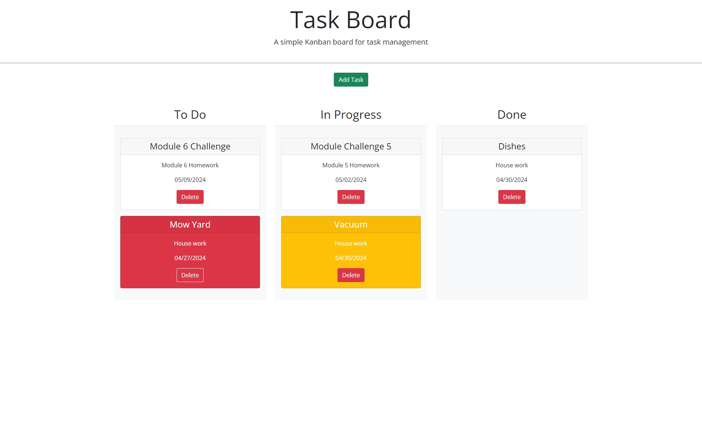

# Task Board

## Description

This project involved creating a task board using several APIs and Libraries. The data collected would dynamically create the necessary elements on the page and populate with the data. Bootstrap was used in the HTML to implement a modal for adding a task inside the box and then a form was created within the modal box to take in the data a user's inputs.  

The first step into populating the table was to give each task a unique ID. There were a couple ways I tried such as using `Math.floor(Math.random())` in combination with `.splice()`. But ultimately I decided it was better to use a secure non-sequential method to generate the ID after reading documentation noting methods relying on `Math.random()` do not guarantee completely unique results. So by using `crypto.randomUUID()` which I had spotted in the Mini Project earlier in this week's classwork, the random unique ID was created for the tasks. The article where I found more information on this method is noted below.

Next up was creating the function to create Task Cards and the corresponding elements for them. This was very familiar from last week's Module assignment and this week's Mini Project. Using what I learned from both exercises and jQuery, I wrote the needed code to create the HTML elements for each task and append them to the proper HTML ID.

For the next step I wanted to create the functions to add the new task and store them into the localStorage before working on rendering them. Once again this week's Mini Project and previous homework exercises helped immensely with this part.

I wanted to render the tasks onto the page to make sure everything was working properly so far so this was the next step I tackled. First I wanted to make sure the task swim lanes were cleared so the page can dynamically update from localStorage as needed. Then I used a `for` loop to assign the tasks to their proper location based on the user's actions. Lastly, was to make the cards draggable and wrote a function inspired by the Mini Project to accomplish this.

Once I made sure things looked good so far I wanted to work on updating the localStorage when the user moves a card to a different lane. Again previous practice helped a bunch with this. I used jQuery to assign the "newStatus" to a specific card based on its ID and then update that status via the localStorage. That was upon page reload the table would stay current to what the user had in their own localStorage.

Now it was time to handle when a card is deleted from the task table. Once again I used jQuery to grab the necessary elements based on their ID. Then if it matches the Event Listener function of getting removed, it disappears from the localStorage.

Lastly, was to call the "renderTaskList" function to pull the items from localStorage. Then it was time to implement the date picker for the date field using the Day.js API. Then using jQuery implement the draggable cards to be dropped into the lanes.

[Link to deployed application.](https://excervantes.github.io/task-board/)

## Installation

N/A

## Usage

To add a new task click the "Add Task" button to open up a modal box. There you you can enter a task title, select a due date from the date picker, and a task description. Each task will color code based on if the task has a due date for the next day and beyond, day of, and past due with white, yellow, and red representing each status respectively.

Each new task will automatically appear in the "To Do" column. You can drag each task into either the "In Progress" or "Done" columns. Once a task is complete or not needed simply click "Delete" within that task's card to remove it completely from the task board.

The task will dynamically update whether they are moved to another lane or if they are deleted. Reloading the page will retain the last state of the tasks on the board.

### Example of Webpage

## Library Elements Used

[Modal](https://getbootstrap.com/docs/5.0/components/modal/)

[Form](https://getbootstrap.com/docs/5.0/forms/overview/)

[Day.js](https://day.js.org/en/)

[jQuery](https://jquery.com/)

## Credits 

"_javascript - How do I create a GUID / UUID? - Stack Overflow_. (2024, March 23). Stack Overflow. Retrieved April 25, 2024, from https://stackoverflow.com/questions/105034/how-do-i-create-a-guid-uuid/2117523

## License

GNU GENERAL PUBLIC LICENSE
Version 3, 29 June 2007

See LICENSE for more info
